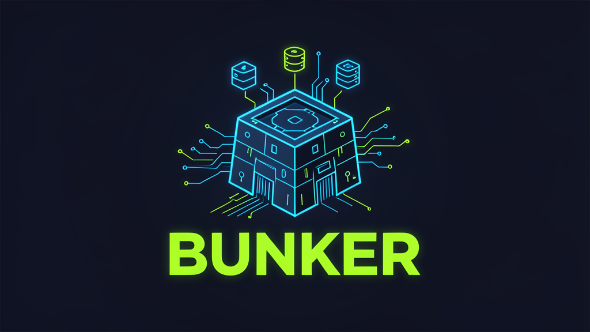

# Bunker — Multi-Agent Coding Platform

> Spin up isolated, resource-limited Linux environments with rootless Docker — each controlled through a single CLI or API call.



[](https://go.dev/)
[](LICENSE)
[](https://connectrpc.com/)
[](https://docs.docker.com/engine/security/rootless/)

---

## What is Bunker?

Bunker is a **multi-agent hosting platform** — a daemon (`bunkerd`) that runs on a Linux host and a CLI (`bunker`) that controls it remotely. Each agent is a fully isolated Linux user with its own rootless Docker daemon, SSH access, resource limits, and optional public networking.

```
┌─────────────────────────────────────────────────────┐
│                    bunkerd                          │
│  ┌──────────┐  ┌──────────┐  ┌──────────┐         │
│  │ agent-a  │  │ agent-b  │  │ agent-c  │  ...50   │
│  │ user     │  │ user     │  │ user     │         │
│  │ dockerd  │  │ dockerd  │  │ dockerd  │         │
│  │ ports    │  │ ports    │  │ ports    │         │
│  └──────────┘  └──────────┘  └──────────┘         │
│         ↑ SSHFS mount / Docker tunnel              │
└─────────────────────────────────────────────────────┘
         │                      │
    ┌────┴────┐            ┌────┴────┐
    │ bunker  │            │ bunker  │
    │ CLI     │            │ CLI     │
    └─────────┘            └─────────┘
```

## Features

- **Isolated agents** — Each agent is a dedicated Linux user with its own home directory, SSH keypair, and rootless Docker daemon
- **Resource limits** — CPU, memory, disk, process count, and open file limits enforced via cgroups (systemd user slice)
- **SSHFS native mount** — Mount any agent's filesystem locally: `bunker mount <id> /mnt/agent`
- **Docker tunnel** — Forward the agent's Docker socket locally: `bunker tunnel <id>` → `docker -H localhost:2376 ps`
- **Multi-server** — One CLI, many `bunkerd` instances. Switch with `--server`
- **Scoped API keys** — Master tokens for admin, agent-scoped sub-keys for CI/CD
- **TTL expiry** — Agents auto-destroy after their time-to-live. Heartbeat to extend
- **Networking** — Cloudflare tunnels (named or TryCloudflare), Tailscale mesh, or direct port ranges
- **gRPC + REST** — Dual protocol via connect-go, single binary
- **TLS/mTLS** — Self-signed, Let's Encrypt (certmagic), or mutual TLS

## Quick Start

### Prerequisites

- Linux host (Ubuntu 24.04+ recommended)
- Go 1.24+
- Docker CE (for rootless support)
- `sshfs` (for mount command)
- `cloudflared` (optional, for tunnels)

### Install

```bash
git clone https://github.com/deployBunker/bunker.git
cd bunker
go build -o bunkerd ./cmd/bunkerd
go build -o bunker ./cmd/bunker
```

### Configure

```bash
cat > /etc/bunkerd/config.yaml << EOF
server:
  grpc_addr: ":9090"
  rest_addr: ":8080"

agent:
  ssh_dir: /etc/bunkerd/ssh
  max_agents: 50
  default_cpu_quota: 2.0           # 2 CPU cores
  default_memory_bytes: 4294967296  # 4 GB
  default_disk_bytes: 21474836480   # 20 GB
  default_max_processes: 4096
  default_max_open_files: 65536
  default_max_docker_containers: 10
  port_range_start: 10000
  port_range_end: 19999
  port_range_per_agent: 100

auth:
  enabled: true
  token: "your-master-token-here"
EOF
```

### Run the daemon

```bash
./bunkerd --config /etc/bunkerd/config.yaml
```

### Use the CLI

```bash
# Connect to a server
bunker connect http://bunker-host:8080 --token your-master-token-here

# Create an agent with 2 CPUs and 4 GB RAM
bunker spawn --cpu 2.0 --memory 4294967296 --ttl 6h

# List agents
bunker list

# Run a command inside the agent (including Docker)
bunker exec abc12345 -- docker run --rm alpine echo hello

# Mount the agent's filesystem locally
bunker mount abc12345 /mnt/my-agent

# Forward the agent's Docker socket
bunker tunnel abc12345
# In another terminal: DOCKER_HOST=tcp://localhost:2376 docker ps

# See agent details
bunker info abc12345

# Extend TTL
bunker heartbeat abc12345

# Tear down
bunker destroy abc12345
```

## Architecture

```
                   gRPC + REST (connect-go)
  ┌──────────┐ ◄──────────────────────────► ┌──────────┐
  │  bunker   │                              │ bunkerd  │
  │   CLI     │    HTTP/2, JSON + Proto      │  daemon  │
  │  (cobra)  │                              │          │
  └──────────┘                              └────┬─────┘
                                                  │
                    ┌─────────────────────────────┼──────────────────┐
                    │                             │                  │
               ┌────▼─────┐              ┌───────▼───────┐   ┌──────▼──────┐
               │  Agent    │              │    Agent      │   │   Agent     │
               │  Manager  │              │   (Linux user) │   │  (Linux     │
               │           │              │   dockerd     │   │   user)     │
               └───────────┘              └───────────────┘   └─────────────┘
                    │
          ┌─────────┼─────────┐
          │         │         │
     user.slice   TTL       Port
     cgroups     reaper    allocator
```

### Services

| Service | Protocol | RPCs |
|---------|----------|------|
| `Bunkerd` | gRPC + REST | `ServerInfo`, `ServerMetrics`, `SpawnAgent`, `DestroyAgent`, `ListAgents`, `GetAgent`, `AgentMetrics`, `ExecAgent`, `HeartbeatAgent` |
| `Agent` | gRPC + REST (scoped) | `GetInfo`, `Metrics`, `Heartbeat` |

## Resource Limits

All limits are enforced at **two levels**:

| Level | Mechanism | Scope |
|-------|-----------|-------|
| User slice | systemd drop-in (`user-<UID>.slice.d/50-bunker.conf`) | All processes running as the agent user |
| Docker unit | `systemd-run --system --property=CPUQuota=...` | The dockerd process and its containers |

| Limit | Config key | CLI flag | Default |
|-------|-----------|----------|---------|
| CPU | `agent.default_cpu_quota` | `--cpu` | 2.0 cores |
| Memory | `agent.default_memory_bytes` | `--memory` | 4 GB |
| Disk | `agent.default_disk_bytes` | `--disk` | 20 GB |
| Processes | `agent.default_max_processes` | — | 4096 |
| Open files | `agent.default_max_open_files` | — | 65536 |
| Docker containers | `agent.default_max_docker_containers` | — | 10 |

## CLI Commands

```
bunker connect     Register a bunkerd server
bunker spawn       Create a new agent
bunker list        List agents
bunker info        Show agent details
bunker exec        Run a command inside an agent
bunker mount       Mount agent filesystem via SSHFS
bunker tunnel      Forward agent Docker socket
bunker metrics     Show resource usage
bunker heartbeat   Extend agent TTL
bunker destroy     Tear down an agent
```

## Tech Stack

| Layer | Technology |
|-------|-----------|
| Language | Go 1.24+ |
| RPC | [connect-go](https://connectrpc.com/) (gRPC + REST, single binary) |
| HTTP router | [chi](https://github.com/go-chi/chi) |
| CLI | [cobra](https://github.com/spf13/cobra) + [viper](https://github.com/spf13/viper) |
| Auth | [golang-jwt](https://github.com/golang-jwt/jwt) v5, opaque sub-keys |
| TLS | [certmagic](https://github.com/caddyserver/certmagic) (self-signed, Let's Encrypt, mTLS) |
| Docker | Rootless via `dockerd-rootless-setuptool.sh` |
| Isolation | Linux user namespaces, systemd cgroups v2 |
| Networking | Cloudflare tunnels, Tailscale mesh, SSH tunneling |
| CI | GitHub Actions |

## Development

```bash
# Build everything
go build ./...

# Run tests
go test ./... -short

# Run E2E battery (requires a running bunkerd)
bash e2e-full-battery.sh

# Run regression suite
bash regression-tests.sh
```

### Quality Gates

- **GitReins Tier 1**: secrets scan, build, lint, tests — enforced on every commit
- **GitReins Tier 2**: LLM-based code review against task criteria
- **Hilo**: dependency graph + blast radius analysis on file changes

## License

Apache 2.0 — see [LICENSE](LICENSE).

Third-party attributions in [NOTICE](NOTICE).

Contributions welcome under the [Contributor License Agreement](CLA.md).

---

Built by the [deployBunker](https://github.com/deployBunker) team. Powered by coding-hermes autonomous foremen.
